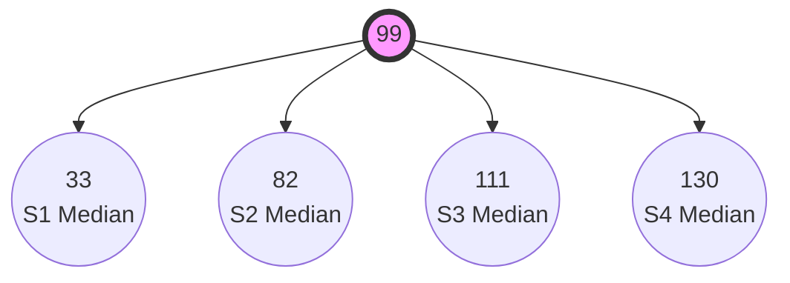
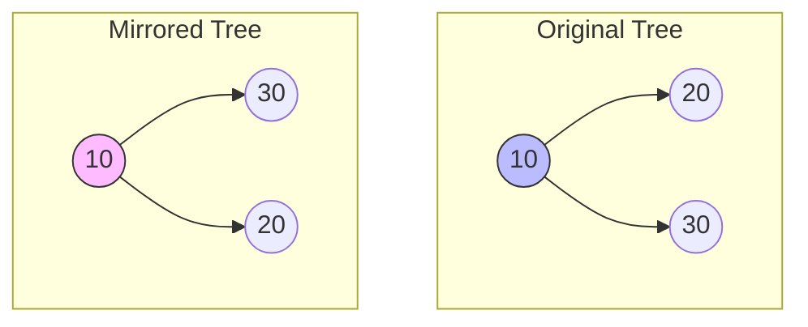
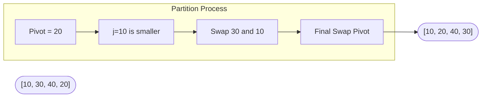
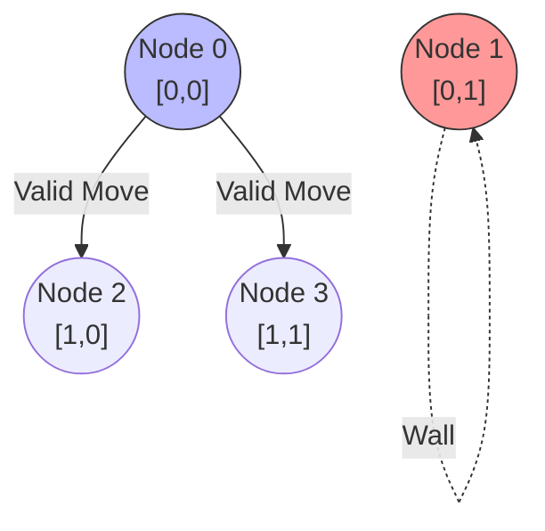

# 🚀 DSA Finals Masterclass: In-Depth Objective Guides

Welcome to the **Deep Dive DSA Guide**. This document breaks down the most complex Data Structures concepts from your past papers. We will cover the general theory, provide scenario walkthroughs with Mermaid diagrams, analyze the C-code line-by-line, and lay out the raw pseudocode. 

---

## 🌳 Part 1: The Median 4-ary Tree (Objective 01)

### 🧠 General Theory
In a standard Binary Search Tree (BST), we split data into 2 paths (Left for smaller, Right for greater). A **4-ary tree** has 4 children per node. To ensure the tree is perfectly balanced, we don't just insert nodes randomly. Instead, we take a sorted array, find the absolute **Median** (the exact middle), make it the root, and then divide the remaining elements into 4 equal quarters (S1, S2, S3, S4). We then recursively find the median of those quarters to become the children!

**💡 Tips & Tricks:**
*   **Base Case is King:** In array-splitting recursion, the base case `if (start > end)` prevents infinite loops.
*   **Integer Math:** In C, `(end - start + 1) / 4` automatically floors the value. Be careful with off-by-one errors when assigning the start/end bounds for the 4 children.

### 🏗️ Scenario & Visual Walkthrough
**Scenario:** You have a sorted array `S = [22, 44, 75, 90, 92, 99, 110, 112, 125, 130, 131]`. (11 elements).
1.  **Median:** The middle element is `99` (Index 5). `99` becomes the Root.
2.  **Quarters:** The remaining 10 elements are split into 4 parts. 
    *   `S1` = [22, 44]
    *   `S2` = [75, 90]
    *   `S3` = [110, 112]
    *   `S4` = [125, 130, 131] (Takes the remainder)



### 💻 Line-by-Line Code Breakdown
```cpp
1: struct Node* buildTree(int* arr, int start, int end, int level) {
2:     if (start > end) return NULL;
3:     
4:     int mid = start + (end - start) / 2;
5:     struct Node* root = createNode(arr[mid], level);
6:     
7:     int n = end - start + 1;
8:     int q = n / 4;
9:     
10:    root->child1 = buildTree(arr, start, start + q - 1, level + 1);
11:    // ... builds remaining 3 children ...
12:    return root;
13:}
```
*   **Line 1:** We pass the array pointer, the `start` bound, `end` bound, and the current tree `level`.
*   **Line 2:** The recursive base case. If `start` passes `end`, we are out of array bounds. Return `NULL`.
*   **Line 4:** Calculates the median index. `start + (end - start) / 2` is used instead of `(start + end) / 2` to prevent integer overflow on massive arrays.
*   **Line 5:** Allocates memory for the new Root node using the median data.
*   **Line 7-8:** Calculates how many elements are in this current sub-array (`n`) and exactly what 25% of that is (`q`).
*   **Line 10:** Recursively calls `buildTree` for the first child. Notice the bounds: `start` to `start + q - 1`. This isolates the exact first 25% of the array for this specific child.

---

## 🪞 Part 2: Level-Order Heap Tree & Mirroring (Objective 02 & 05)

### 🧠 General Theory
A **Heap-style** tree is a *Complete Binary Tree*. This means every level is fully filled from left to right before moving to the next level. You CANNOT insert using standard BST logic (where < goes left, > goes right). Instead, you must use a **Queue (Breadth-First Search)** to find the first available empty child slot from top-to-bottom, left-to-right.
**Mirroring** a tree is the process of physically swapping the `left` and `right` pointers of every single node in the tree.

**💡 Tips & Tricks:**
*   Since you can't use C++ STL `<queue>`, you must implement an inline array-based queue: `struct Node* queue[100]; int front = 0, rear = 0;`.
*   Mirroring is best done using **Post-Order Traversal** (process left, process right, then swap).

### 🏗️ Scenario & Visual Walkthrough
**Scenario:** Insert `[10, 20, 30]` heap-style, then mirror it.
1. `10` is root.
2. Queue checks `10`. Left is NULL. `20` becomes `10->left`.
3. Queue checks `10`. Right is NULL. `30` becomes `10->right`.



### 💻 Line-by-Line Code Breakdown (Mirror)
```cpp
1: void mirrorTree(struct Node* root) {
2:     if (root == NULL) return;
3:     
4:     mirrorTree(root->left);
5:     mirrorTree(root->right);
6:     
7:     struct Node* temp = root->left;
8:     root->left = root->right;
9:     root->right = temp;
10:}
```
*   **Line 2:** Base case. If we hit a NULL leaf, stop traversing.
*   **Line 4-5:** We dive all the way down to the deepest left node, then the deepest right node before doing any work (Post-order).
*   **Line 7-9:** The actual swap. We store the `left` pointer in a `temp` variable, overwrite `left` with `right`, and then overwrite `right` with the `temp`. This physically flips the tree structure in memory!

---

## ⚡ Part 3: Doubly Linked List In-Place QuickSort (Objective 03)

### 🧠 General Theory
QuickSort on an array is easy because we have random access (`arr[5]`). On a Doubly Linked List (DLL), we don't! We can only move `next` or `prev`. To do an **in-place QuickSort** (without allocating new arrays), we use **Lomuto's Partition Scheme**. 
We pick the last node as the `pivot`. We maintain two pointers: `i` tracks the boundary of elements smaller than the pivot, and `j` scans the list. When `j` finds a smaller element, `i` moves forward, and we swap their data.

**💡 Tips & Tricks:**
*   **Swap Data, Not Pointers!** Swapping `next` and `prev` pointers in a DLL during a sort is an absolute nightmare and prone to segfaults. Just swap the `int data` inside the nodes!

### 🏗️ Scenario & Visual Walkthrough
**Scenario:** DLL = `[30 <-> 10 <-> 40 <-> 20]`. Pivot = `20`.
1. `i` starts at NULL. `j` starts at `30`.
2. `j=30` > `20`. Do nothing.
3. `j=10` < `20`. Advance `i` to first node (`30`). Swap `i` and `j` data. List becomes `[10, 30, 40, 20]`.
4. `j=40` > `20`. Do nothing.
5. Loop ends. Swap `i->next` (which is `30`) with Pivot (`20`). List becomes `[10, 20, 40, 30]`. Pivot `20` is now in its exact correct sorted position!



### 💻 Line-by-Line Breakdown (Partition)
```cpp
1: struct Node* partition(struct Node* start, struct Node* end) {
2:     int pivot = end->data;
3:     struct Node* i = start->prev;
4:     
5:     for (struct Node* j = start; j != end; j = j->next) {
6:         if (j->data <= pivot) {
7:             i = (i == NULL) ? start : i->next;
8:             int temp = i->data;
9:             i->data = j->data;
10:            j->data = temp;
11:        }
12:    }
13:    i = (i == NULL) ? start : i->next;
14:    int temp = i->data;
15:    i->data = end->data;
16:    end->data = temp;
17:    return i;
18:}
```
*   **Line 2-3:** Pivot is the last element's data. `i` starts *one position behind* `start`.
*   **Line 5:** Standard DLL traversal loop up to (but not including) the `end` node.
*   **Line 6-7:** If `j` finds a small value, we move `i` forward. If `i` was NULL, moving it forward means it points to `start`.
*   **Line 8-10:** We swap the `data` payloads of nodes `i` and `j`. No pointer manipulation required!
*   **Line 13-16:** Finally, we move the pivot element (`end`) into its correct sorted position right after `i`.

---

## 🗺️ Part 4: Maze BFS via Adjacency List (Objective 09 & 12)

### 🧠 General Theory
Graph theory algorithms (BFS/DFS) don't naturally understand a 2D Array `[row][col]`. You must first **Map the Grid to a Graph**. 
Each cell in an `n x m` grid gets a unique 1D integer ID: `NodeID = row * m + col`. 
For every `0` (walkable cell), you look in all 8 directions. If a neighbor is also a `0`, you create a directed edge in an **Adjacency List**. Once the list is built, you run standard Breadth-First Search (BFS) using a Queue to find the shortest path.

**💡 Tips & Tricks:**
*   Always use a `visited[]` array! If you don't, your BFS will bounce back and forth between two nodes infinitely.
*   Use a `parent[]` array. When `A` discovers `B`, `parent[B] = A`. This is the ONLY way to reconstruct the exact path once you reach the exit.

### 🏗️ Scenario & Visual Walkthrough
**Scenario:** A 2x2 grid. `[0, 1]` on row 1, `[0, 0]` on row 2.
`Node 0 (0,0)` is connected to `Node 2 (1,0)` and `Node 3 (1,1)`.
BFS Queue: Push `0`. Pop `0`, push its unvisited neighbors `2` and `3`. Record their parent as `0`. Pop `2`... etc.



### 💻 Line-by-Line Breakdown (Graph Mapping)
```cpp
1: int dx[] = {-1, -1, -1, 0, 0, 1, 1, 1};
2: int dy[] = {-1, 0, 1, -1, 1, -1, 0, 1};
3: 
4: for (int i = 0; i < n; i++) {
5:     for (int j = 0; j < m; j++) {
6:         if (maze[i][j] == 1) continue;
7:         
8:         int u = i * m + j;
9:         for (int k = 0; k < 8; k++) {
10:            int ni = i + dx[k];
11:            int nj = j + dy[k];
12:            
13:            if (ni >= 0 && ni < n && nj >= 0 && nj < m && maze[ni][nj] == 0) {
14:                int v = ni * m + nj;
15:                addEdge(graph, u, v);
16:            }
17:        }
18:    }
19:}
```
*   **Line 1-2:** Directional arrays. These represent the (x, y) offsets for all 8 compass directions (N, S, E, W, NE, NW, SE, SW).
*   **Line 6:** If the current cell is a wall (`1`), skip it entirely.
*   **Line 8:** Calculate the unique 1D `u` Node ID for the current `(i,j)` coordinate.
*   **Line 10-11:** Apply the offset to get the neighbor's coordinate `(ni, nj)`.
*   **Line 13:** The boundary check! Ensure `ni` and `nj` haven't fallen off the edge of the board, AND that the neighbor is a walkable `0`.
*   **Line 14-15:** Calculate the neighbor's 1D `v` Node ID, and add an edge from `u` to `v` in the Adjacency List.
