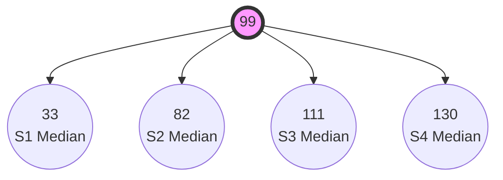
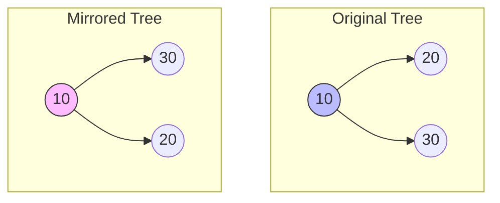
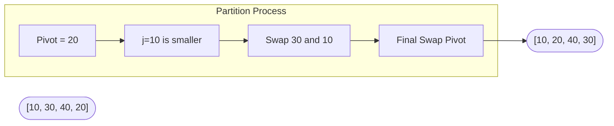
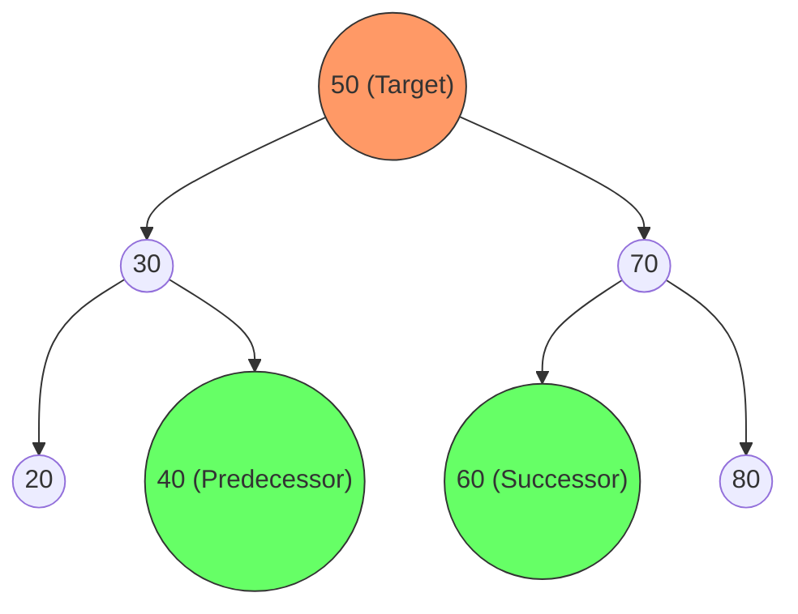
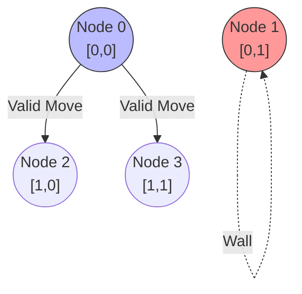

# 🚀 DSA Finals Masterclass: The Complete 12-Objective Guide

Welcome to the **Deep Dive DSA Guide**. This document breaks down the most complex Data Structures concepts from your past papers. It covers the general theory, provides scenario walkthroughs with Mermaid diagrams, analyzes the C-code line-by-line, and gives you the exact logic you need for your final lab exam. 

---

## 🌳 Part 1: The Median 4-ary Tree (Objective 01)

### 🧠 General Theory
In a standard Binary Search Tree (BST), we split data into 2 paths. A **4-ary tree** has 4 children per node. To ensure the tree is perfectly balanced, we take a sorted array, find the absolute **Median** (the exact middle), make it the root, and then divide the remaining elements into 4 equal quarters (S1, S2, S3, S4). We then recursively find the median of those quarters to become the children!

**💡 Tips & Tricks:**
*   **Base Case is King:** In array-splitting recursion, the base case `if (start > end)` prevents infinite loops.
*   **Integer Math:** In C, `(end - start + 1) / 4` automatically floors the value. Be careful with off-by-one errors when assigning bounds.

### 🏗️ Scenario & Visual Walkthrough
**Scenario:** You have a sorted array `S = [22, 44, 75, 90, 92, 99, 110, 112, 125, 130, 131]`.
1.  **Median:** The middle element is `99`. `99` becomes the Root.
2.  **Quarters:** The remaining 10 elements are split into 4 parts. 



### 💻 Line-by-Line Code Breakdown
```cpp
1: struct Node* buildTree(int* arr, int start, int end, int level) {
2:     if (start > end) return NULL;
3:     
4:     int mid = start + (end - start) / 2;
5:     struct Node* root = createNode(arr[mid], level);
6:     
7:     int n = end - start + 1;
8:     int q = n / 4;
9:     
10:    root->child1 = buildTree(arr, start, start + q - 1, level + 1);
11:    // ... builds remaining 3 children ...
12:    return root;
13:}
```
*   **Line 4:** Calculates median index. `start + (end - start) / 2` is used instead of `(start + end) / 2` to prevent integer overflow.
*   **Line 7-8:** Calculates exactly what 25% of the current chunk is (`q`).
*   **Line 10:** Recursively calls for the first child. The bounds `start` to `start + q - 1` isolate the exact first 25% of the array.

---

## 🪞 Part 2: Level-Order Heap Tree & Mirroring (Objective 02 & 05)

### 🧠 General Theory
A **Heap-style** tree is a *Complete Binary Tree*. Every level is fully filled from left to right. You CANNOT insert using standard BST logic. Instead, use a **Queue (Breadth-First Search)** to find the first available empty child slot. **Mirroring** a tree is physically swapping the `left` and `right` pointers of every single node in the tree using Post-Order Traversal.

### 🏗️ Scenario & Visual Walkthrough
**Scenario:** Insert `[10, 20, 30]` heap-style, then mirror it.



### 💻 Line-by-Line Code Breakdown (Mirror)
```cpp
1: void mirrorTree(struct Node* root) {
2:     if (root == NULL) return;
3:     
4:     mirrorTree(root->left);
5:     mirrorTree(root->right);
6:     
7:     struct Node* temp = root->left;
8:     root->left = root->right;
9:     root->right = temp;
10:}
```
*   **Line 4-5:** Dive down to the deepest nodes first (Post-order).
*   **Line 7-9:** The actual swap. Store `left` in a `temp` variable, overwrite `left` with `right`, and overwrite `right` with `temp`. This physically flips the tree!

---

## ⚡ Part 3: DLL In-Place QuickSort (Objective 03)

### 🧠 General Theory
QuickSort on a Doubly Linked List uses **Lomuto's Partition Scheme**. We pick the last node as the `pivot`. We maintain two pointers: `i` tracks the boundary of elements smaller than the pivot, and `j` scans the list. When `j` finds a smaller element, `i` moves forward, and we swap their `data`.

**💡 Tips & Tricks:**
*   **Swap Data, Not Pointers!** Swapping `next` and `prev` pointers in a DLL sort is a nightmare. Just swap the `int data`!

### 🏗️ Scenario & Visual Walkthrough
**Scenario:** DLL = `[30 <-> 10 <-> 40 <-> 20]`. Pivot = `20`.



### 💻 Line-by-Line Breakdown
```cpp
1: struct Node* partition(struct Node* start, struct Node* end) {
2:     int pivot = end->data;
3:     struct Node* i = start->prev;
4:     
5:     for (struct Node* j = start; j != end; j = j->next) {
6:         if (j->data <= pivot) {
7:             i = (i == NULL) ? start : i->next;
8:             int temp = i->data;
9:             i->data = j->data;
10:            j->data = temp;
11:        }
12:    }
13:    i = (i == NULL) ? start : i->next;
14:    int temp = i->data;
15:    i->data = end->data;
16:    end->data = temp;
17:    return i;
18:}
```
*   **Line 2-3:** Pivot is the last element. `i` starts *one position behind* `start`.
*   **Line 6-7:** If `j` is small, move `i` forward. If `i` was NULL, point it to `start`.
*   **Line 8-10:** Swap the `data` payloads. No pointer manipulation!

---

## 🔍 Part 4: BST Search, Predecessor & Successor (Objective 04)

### 🧠 General Theory
In a standard Binary Search Tree, the **Predecessor** is the node that comes immediately before the target in sorted order (the MAX value in the left subtree). The **Successor** is the node that comes immediately after (the MIN value in the right subtree). 

### 🏗️ Visual Walkthrough


### 💻 Line-by-Line Breakdown (Finding Pred/Succ)
```cpp
1: void findPredSucc(struct Node* root, int key, struct Node** pred, struct Node** succ) {
2:     if (root == NULL) return;
3:     if (root->data == key) {
4:         if (root->left != NULL) {
5:             struct Node* temp = root->left;
6:             while (temp->right) temp = temp->right;
7:             *pred = temp;
8:         }
9:         if (root->right != NULL) {
10:            struct Node* temp = root->right;
11:            while (temp->left) temp = temp->left;
12:            *succ = temp;
13:        }
14:        return;
15:    }
16:    if (root->data > key) {
17:        *succ = root;
18:        findPredSucc(root->left, key, pred, succ);
19:    } else {
20:        *pred = root;
21:        findPredSucc(root->right, key, pred, succ);
22:    }
23:}
```
*   **Line 4-8:** If the target has a left child, the predecessor is the right-most node in that left subtree.
*   **Line 16-18:** If we turn left to find the key, the current node might be our successor! We record it just in case.

---

## 🔗 Part 5: SLL & DLL Sorted Insert & Reverse (Objectives 06 & 07)

### 🧠 General Theory
When inserting into a list, you must scan until `current->next->data > value`, then wedge the new node in. When **reversing by copying**, you just read the old list from left to right, but insert every new node at the `HEAD` of the new list. This naturally reverses it without messy pointer logic!

**💡 Tips for Doubly Linked Lists:**
When inserting between `A` and `B`, you must update `A->next`, `newNode->prev`, `newNode->next`, and crucially `B->prev`.

### 💻 Line-by-Line Breakdown (DLL Sorted Insert)
```cpp
1: void sortedInsert(struct Node** head, int val) {
2:     struct Node* newNode = createNode(val);
3:     if (*head == NULL || (*head)->data >= val) {
4:         newNode->next = *head;
5:         if (*head != NULL) (*head)->prev = newNode;
6:         *head = newNode;
7:         return;
8:     }
9:     struct Node* curr = *head;
10:    while (curr->next != NULL && curr->next->data < val) curr = curr->next;
11:    
12:    newNode->next = curr->next;
13:    if (curr->next != NULL) curr->next->prev = newNode;
14:    curr->next = newNode;
15:    newNode->prev = curr;
16:}
```
*   **Line 3-8:** Edge case! The new value belongs at the absolute front.
*   **Line 10:** Scan forward until we find the gap where `val` belongs.
*   **Line 12-15:** The delicate pointer dance. Order matters. Link `newNode` to the right side first (Lines 12-13), then link the left side to `newNode` (Lines 14-15).

---

## ⚖️ Part 6: BST Equality & Descending Sort (Objective 08)

### 🧠 General Theory
To check if two trees are completely equal, both the **Data** and the **Structure** must match. If you only care about structure, just skip checking `data == data`. To print a BST in descending order, you just do a **Reverse In-Order Traversal** (Right -> Root -> Left).

### 💻 Line-by-Line Breakdown
```cpp
1: int isEqual(struct Node* t1, struct Node* t2) {
2:     if (t1 == NULL && t2 == NULL) return 1;
3:     if (t1 != NULL && t2 != NULL) {
4:         return (t1->data == t2->data &&
5:                 isEqual(t1->left, t2->left) &&
6:                 isEqual(t1->right, t2->right));
7:     }
8:     return 0;
9: }
10:
11: void printDescending(struct Node* root) {
12:    if (root == NULL) return;
13:    printDescending(root->right);
14:    printf("%d ", root->data);
15:    printDescending(root->left);
16:}
```
*   **Line 2:** Base case for equality. Two empty trees are identical.
*   **Line 4-6:** Ensure the current node's data matches, AND the entire left subtree matches, AND the entire right subtree matches.

---

## 🔄 Part 7: DLL In-Place Reverse & MinMax Extraction (Objectives 10 & 11)

### 🧠 General Theory
To reverse a DLL without copying it, you literally just walk through every node and swap its `next` and `prev` pointers. 
To extract the Minimum node and move it to the Head, you must **detach** it from the middle of the list (by bridging its neighbors) and attach it to the front.

### 💻 Line-by-Line Breakdown (In-Place Reverse)
```cpp
1: void reverseDLL(struct Node** head) {
2:     struct Node* temp = NULL;
3:     struct Node* curr = *head;
4:     
5:     while (curr != NULL) {
6:         temp = curr->prev;
7:         curr->prev = curr->next;
8:         curr->next = temp;
9:         curr = curr->prev; 
10:    }
11:    if (temp != NULL) *head = temp->prev;
12:}
```
*   **Line 6-8:** The swap. We swap `curr->next` and `curr->prev` right here.
*   **Line 9:** Wait, `curr = curr->prev`?! Yes! Because we just swapped the pointers, the "next" node in the list is now technically stored inside `curr->prev`!

---

## 🗺️ Part 8: Maze BFS via Adjacency List (Objective 09 & 12)

### 🧠 General Theory
Each cell in an `n x m` grid gets a unique 1D integer ID: `NodeID = row * m + col`. 
For every `0` (walkable cell), you look in all 8 directions. If a neighbor is also a `0`, you create a directed edge in an **Adjacency List**. You then run Breadth-First Search (BFS) using a Queue to find the shortest path.

### 🏗️ Scenario & Visual Walkthrough


### 💻 Line-by-Line Breakdown (Graph Mapping)
```cpp
1: int dx[] = {-1, -1, -1, 0, 0, 1, 1, 1};
2: int dy[] = {-1, 0, 1, -1, 1, -1, 0, 1};
3: 
4: for (int i = 0; i < n; i++) {
5:     for (int j = 0; j < m; j++) {
6:         if (maze[i][j] == 1) continue;
7:         
8:         int u = i * m + j;
9:         for (int k = 0; k < 8; k++) {
10:            int ni = i + dx[k];
11:            int nj = j + dy[k];
12:            
13:            if (ni >= 0 && ni < n && nj >= 0 && nj < m && maze[ni][nj] == 0) {
14:                int v = ni * m + nj;
15:                addEdge(graph, u, v);
16:            }
17:        }
18:    }
19:}
```
*   **Line 1-2:** Direction offsets for N, S, E, W, NE, NW, SE, SW.
*   **Line 8:** Calculate the unique 1D `u` Node ID for the current `(i,j)` coordinate.
*   **Line 13:** The boundary check! Ensure `ni` and `nj` haven't fallen off the edge of the board, AND that the neighbor is a walkable `0`.
