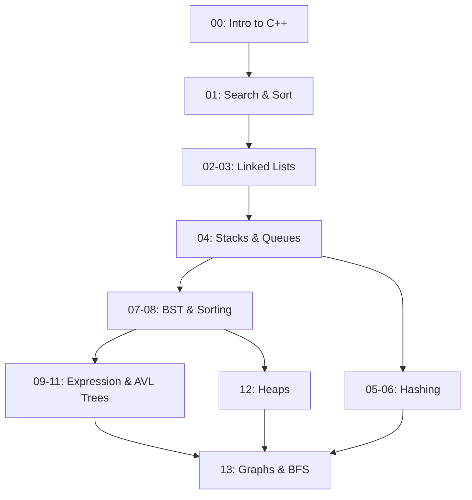

  <h1>DSA 3rd Semester Labs</h1>
  
<i>Repository for the <b>CS-451 Data Structures & Applications</b> course.</i>

  
  
  
  

 

Welcome to the Data Structures and Applications repository. This repository contains all practice programs, weekly lab tasks, home tasks, and solutions to past papers. Everything is organized week by week to make it easy to navigate and review.

---

## 🗺️ Curriculum Map

---

## What's Inside

| Path | Contents |
| --- | --- |
| `00-Intro-to-CPP/` | C++ basics: pointers, functions, arrays, dynamic memory. |
| `01-Searching-and-Sorting/` | Searching algorithms and basic sorting techniques. |
| `02-Singly-Linked-Lists/` | Insertion sort and basic singly linked lists (SLL). |
| `03-Doubly-and-Circular-Lists/` | Doubly linked lists (DLL), circular variants (CLL), and deletion logic. |
| `04-Stacks-and-Queues/` | Static arrays vs Dynamic implementations for stacks and queues. |
| `05-Hash-Tables/` | Linear and quadratic probing, basic hash tables. |
| `06-Advanced-Hashing/` | Advanced hashing, chaining, and multi-lists. |
| `07-Binary-Search-Trees/` | Getting started with Binary Search Trees, Merge Sort, and Quick Sort. |
| `08-BST-Deletion/` | Removing nodes from a Binary Search Tree. |
| `09-Infix-to-Postfix/` | Infix to postfix expression conversions. |
| `10-AVL-Trees/` | AVL trees and rotations. |
| `11-Expression-Trees/` | Expression trees and postfix mathematical evaluation. |
| `12-Heaps/` | Max and Min Heaps implementation along with sorting. |
| `13-Graphs/` | Graph fundamentals, Adjacency Lists, Adjacency Matrices, and BFS. |
| `Practice/` | Extra implementations for BST and AVL trees. |
| `Mid Term Prep/` | Revision code and setups for midterm preparation. |
| `Past Papers/` | Solutions to past-paper objectives implemented using core C++ constraints. |

---

## Implementation Details
The code throughout this repository is written in standard **C-style C++**. Implementations strictly use `structs`, manual memory management (`malloc`/`free`), and pointers. Complex Object-Oriented Programming principles and standard template libraries were intentionally avoided to focus purely on the fundamental logic of data structures.
